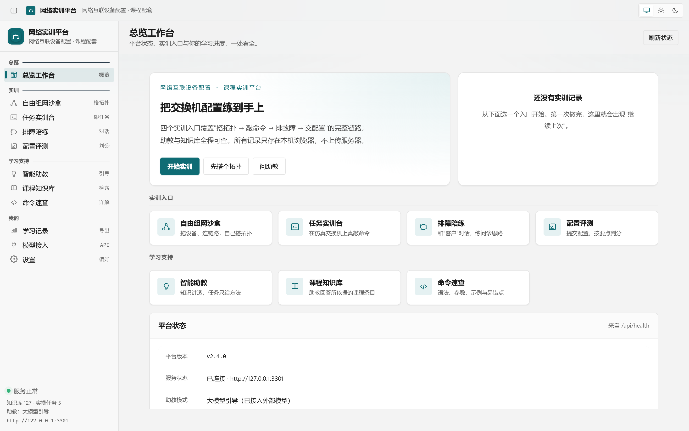
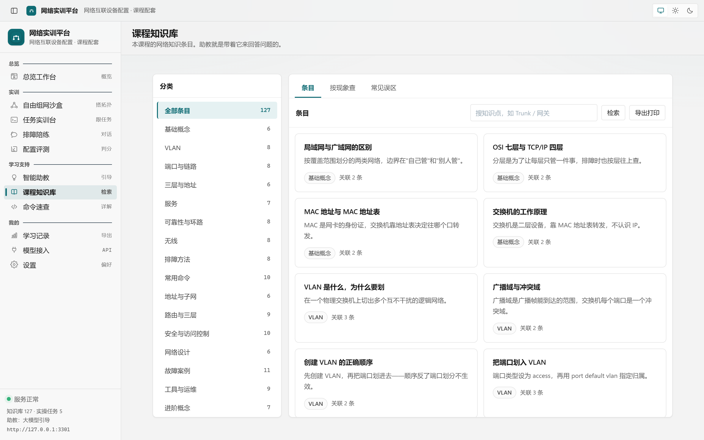
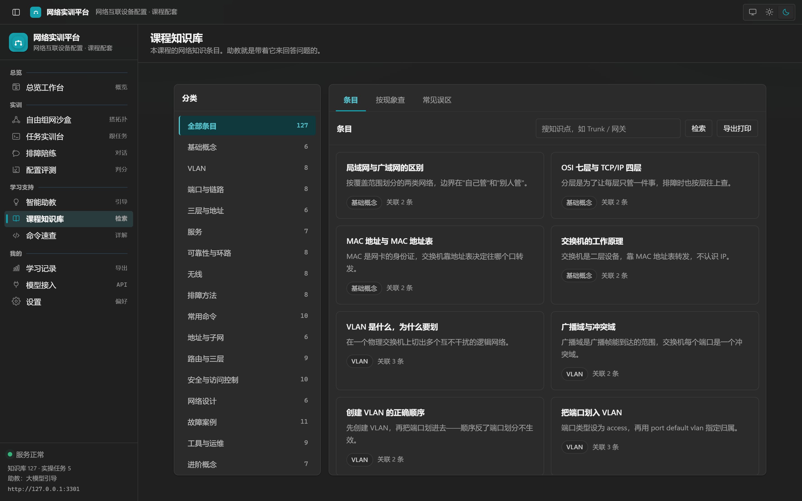
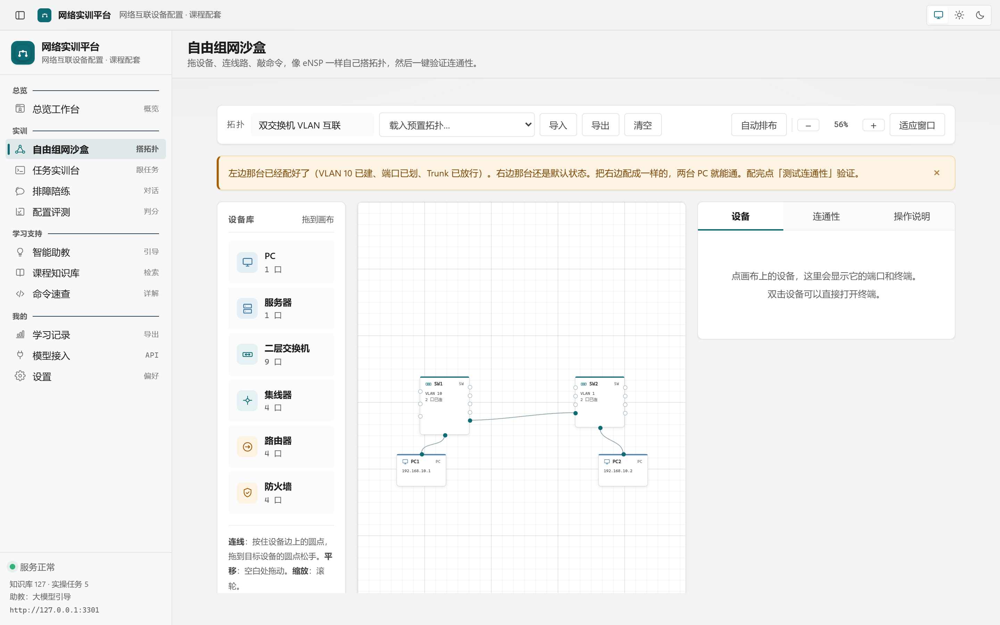

# 网络实训平台 · NetworkLab

**把交换机"配置到手上"的课程实训平台 —— 拖一拖、敲一敲、立刻看到结果**

**交换机仿真实操 · 排障陪练 · 配置评测 · 智能助教 · 课程知识库**

*《网络互联设备配置》课程配套实训平台 —— 全部内容在本机运行，断网也能上课*

**下载** → [Releases 最新版](../../releases/latest) ｜ **使用文档** → [使用文档.md](使用文档.md)

---

## ✨ 功能特性

| 模块 | 能做什么 |
| :-- | :-- |
| 🔌 **自由组网沙盒** | 像 eNSP 一样拖设备、连线路，逐台敲命令，一键验证通不通（双向 ping 仿真，不通时告诉你卡在哪一跳） |
| 🖥 **任务实训台** | 5 个递进任务：建 VLAN → 划端口 → 配 Trunk → 配管理地址 → 综合配置，右侧设备实况面板实时跟着变 |
| 🧑‍🔧 **排障陪练** | 10 个故障工单，AI 扮演"报修客户"跟你对话——练的是把问题问清楚的功夫，不直接给答案 |
| ✅ **配置评测** | 提交配置后按 4 类关键判定点自动打分，秒级反馈错在哪 |
| 💡 **智能助教** | 讲解型 / 引导型双模式：问知识就讲透，问作业只教方法；配一个大模型 API Key 就能联网对话，不配也能用本地引导 |
| 📚 **课程知识库** | 127 条 / 16 分类课程知识 + 34 条华为 VRP 命令详解，支持按现象反查、一键导出打印 |
| 🔄 **版本更新** | 有新版本走 Windows 通知中心提醒，一键跳转下载 |

**界面**：Windows 11 Fluent 风格，深浅双主题，**中英双语切换**（设置 → 通用）。

| 浅色主题 | 深色主题 |
| :-- | :-- |
|  |  |

## 🎯 适合谁用

- **网络专业学生**：课前预习、课后练习，把课堂上"看不见摸不着"的配置变成能动手的操作
- **授课教师**：课堂演示、布置实训任务、配合排障陪练做过程性评价
- **网络入门学习者**：零基础也能跟着引导一步步做

## 📥 下载与安装

1. 前往 [**Releases 最新版**](../../releases/latest)，下载 `NetworkLab-2.4.0-Setup.exe`（约 103 MB）；
2. 双击运行，按向导完成安装（8 页向导：许可协议 → 安装位置 → 快捷方式等，默认即可）；
3. 从开始菜单或桌面快捷方式启动，**打开就是软件窗口，不会跳到浏览器**。

> [!NOTE]
> 软件未做代码签名，首次运行若 Windows 提示「已保护你的电脑」，点【**更多信息 → 仍要运行**】即可，属正常提示。

> [!TIP]
> 卸载时你的配置数据（如 API Key）默认保留，不会误删。

## 🚀 快速上手（30 秒体验）

1. 打开软件，首页点 **【开始实训】** 或左侧 **自由组网沙盒**；
2. 从左侧设备库**拖一台交换机**到画布，再拖两台电脑，**连线**；
3. 点交换机打开**终端**，敲 `system-view` 试试——命令提示会跟着出来；
4. 点 **连通性** 看两台电脑通不通，不通就按提示排查；
5. 有疑问？去 **智能助教** 问，或者 **课程知识库** 搜。

## 💻 系统要求

| 项 | 要求 |
| :-- | :-- |
| 操作系统 | Windows 10 / 11 x64 |
| 内存 | 4 GB 及以上 |
| 网络 | **不需要**——安装后全部功能离线可用 |
| 联网（可选） | 仅「智能助教」联网对话需要：自行配置一个 OpenAI 兼容的 API Key；不配置则使用本地引导模式 |

## ❓ 常见问题

<b>安装时提示「已保护你的电脑」？</b>

软件未做代码签名，属 Windows 正常提示。点【更多信息 → 仍要运行】即可。

<b>断网了还能用吗？</b>

能。全部功能在本机运行，智能助教在未配置模型时走本地引导模式。

<b>「智能助教」怎么才能真的对话？</b>

在「模型接入」页配置一个 OpenAI 兼容的 API Key（内置 DeepSeek / 通义千问 / 智谱 / Kimi 等预设，含申请指引）。密钥只存本机，界面上只显示掩码。

<b>卸载会丢我的配置吗？</b>

不会。卸载时用户数据默认保留；想彻底清理可在卸载时确认删除。

<b>怎么知道有新版本？</b>

「设置 → 更新 → 检查更新」手动查；有新版本时 Windows 通知中心也会提醒（同版本只提醒一次）。

## 📋 更新日志

见 [更新日志.md](更新日志.md)。

## 📄 许可证

[MIT](LICENSE)。

## 👤 作者

**赵耘锋** —— 问题与建议请提 [Issues](../../issues)。
